# ImageNet Validation with Microcontroller Tutorial

This repository is a tutorial of inferencing ImageNet validation dataset with a STmicroelectronics Microcontroller(MCU) using X-CUBE-AI.

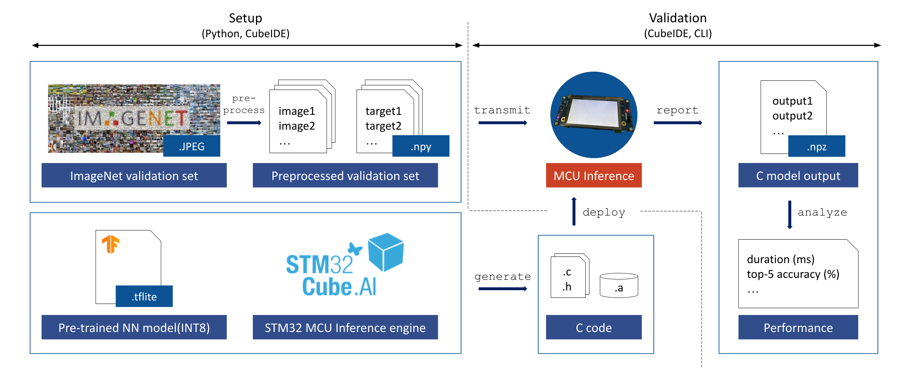

---

## 1. Tutorial Structure

```
├── assets                       # MCU target model, tutorial figures folder.
│   ├── tutorial_samples         # our sample ImageNet validation data in npy format.
│   └── mcunet_...tflite         # target model file. (not included)
├── configs                      # user configurations for the tutorial.                           
│   ├── cli_command.yaml         # CLI command configurations for the validation on the STM32 target MCU.
│   └── sampling.yaml            # sampling configurations for the ImageNet validation data to npy format.
├── inference_outputs            # MCU inference outputs folder.                              
│   ├── 1 
│   ├── 2
│   └── ...
├── utils                        # utility scripts for the tutorial.
│   ├── configs.py               # configuration parser for the tutorial.
│   ├── dataset.py               # ImageNet dataset loader 
│   └── sampler.py               # ImageNet dataset sampler 
├── npy_samples                  # validation data subsets in npy format.
├── workspace                    # STM32CubeIDE project codes (will be updated)
├── val_sample_to_npy.py         # python script to convert ImageNet validation data to npy format.
└── validate_on_target.ipynb     # CLI script to validate the TFLite model on the STM32 target MCU.
```

---

## 2. Prerequisites

> Information: only tested with STM32H7B3I-DK MCU board.

### Requirements

- Numpy   

- Python  

- PyTorch 

### Installations

- STM32CubeIDE (latest tested v1.14.1) [[Link](https://www.st.com/en/development-tools/stm32cubeide.html)]

- X-CUBE-AI Software Packs (latest tested v9.0.0)

- ST-LINK Utility

### Model and Data Preparation

- Model file (`assets/mcunet-512kb-2mb_imagenet.tflite`) [[Link](https://hanlab18.mit.edu/projects/tinyml/mcunet/release/mcunet-512kb-2mb_imagenet.tflite)]

  (This tutorial will use the 'MCUNet: Tiny Deep Learning on IoT Devices' model: [[GitHub](https://github.com/mit-han-lab/mcunet/tree/master)])

- ImageNet validation dataset  [[Link](https://www.image-net.org/)]

  (If don't want to download the dataset, you can use sample ImageNet dataset in the `assets/tutorial_samples/`)

---

## 3. Step-by-Step Tutorial

> Information: you can refer to the STM32 official tutorial **"How to automatize code generation and validation with X-CUBE-AI CLI"** [[Link](https://wiki.stmicroelectronics.cn/stm32mcu/wiki/AI:How_to_automatize_code_generation_and_validation_with_X-CUBE-AI_CLI)]

### STEP 1. Create the STM32CubeIDE project.

1. Open STM32CubeIDE and create a new project. 

    - [File] - [New] - [STM32 Project]

2. Select the board to use, STM32H7B3I-DK MCU in the example, and create a project **without initializing all peripherals with their default mode**. 

    - [Board Selector] - [STM32H7B3I-DK] - [Next]

    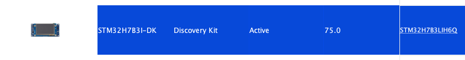 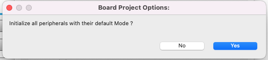

3. Select Software Packs to use. 

    - [Software Packs] - [Select Components] - [STMicroelectronics.X-CUBE-AI] - [Ok]

    - Check '[Artifitial Intelligence X-CUBE-AI] - [Core]' and select '[Device Application] - [Application] - [Validation]'

    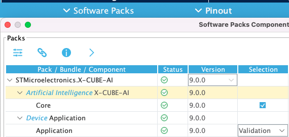

4. System will ask to fix the clock and peripheral configuration. Click [Yes] to automatically fix the setting.

    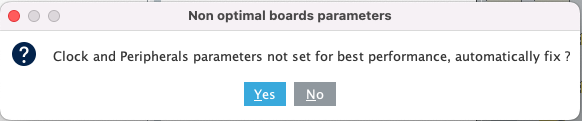


### STEP 2. Setup the X-CUBE-AI configuration and analyze the model.

1. Set up the X-CUBE-AI configuration. 

    - [Categories] - [Middleware and Software Packs] - [X-CUBE-AI] - [Add network]

    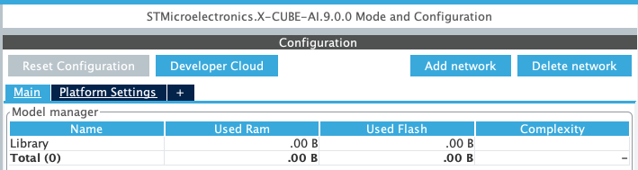

2. Select the model file (`.tflite`) and change advanced settings.

    - Set 'Report's output directory' to `{tutorial_path}/inference_output/`

    - Check the 'Force classifier validation output (--classifier)' option

    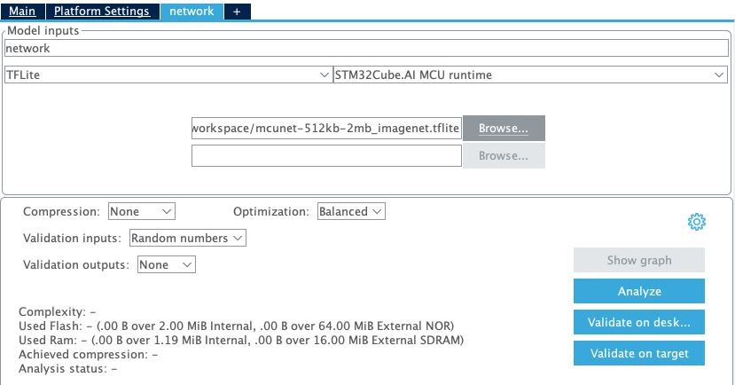 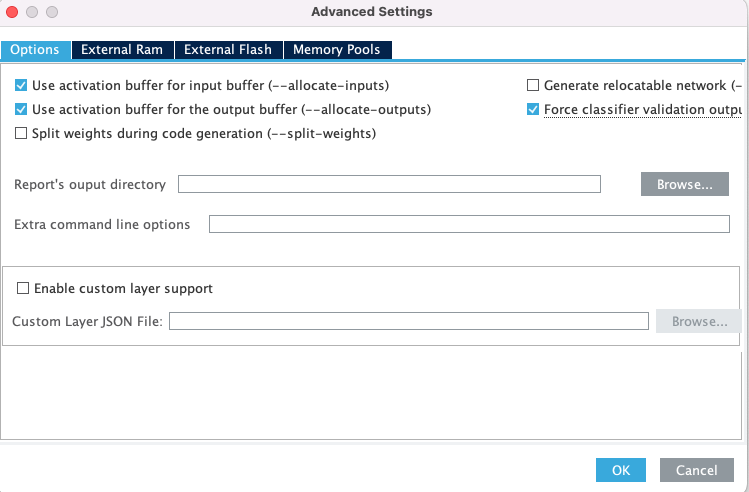

3. If system does not analyze automatically, start [Analyze] to check the model complexity. 

    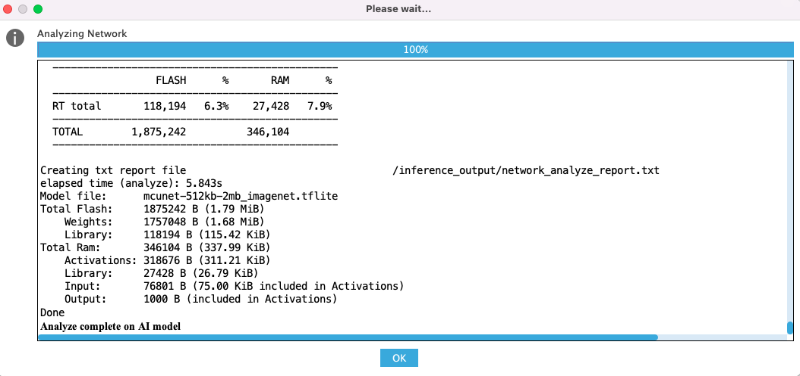

    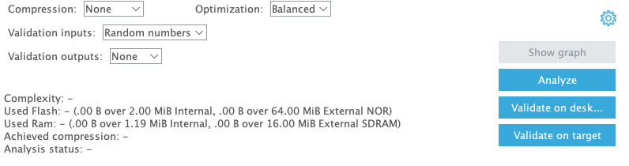


### STEP 3. Generate and build the code for the STM32 target.

1. Generate the source code. 

    - [Project] - [Generate Code]

2. Build the project. 

    - [Project] - [Build Project]

    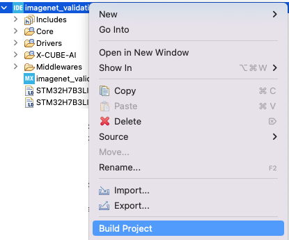

3. Deploy on the target. 

    - [Run As] - [STM32 C/C++ Application]

    - If fails, please check your ST-Link firmware. ([Help] - [ST-LINK Upgrade])

    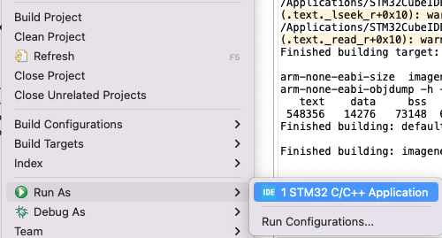


### STEP 4. (Optional) Convert ImageNet validation data to npy format.

- If you want to convert ImageNet validation data to npy format, please run the following script. 

- Alternatively, you can the sample data in the `assets/tutorial_samples/`.

```bash
python val_sample_to_npy.py ./configs/sampling.yaml
```


### STEP 5. Evaluate the TFLite model on ImageNet validation dataset. 

1. Select ImageNet Validation inputs, and outputs (`.npy`) on X-CUBE-AI configuration.

    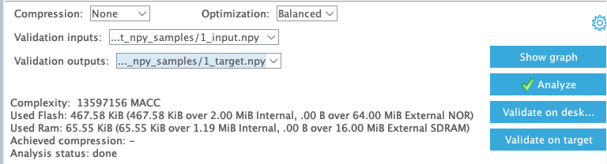

2. Click [Validation on target] and select communication port 

    - [Manual] - your COM port

    - Do not check 'Automatic compilation and download' option.

    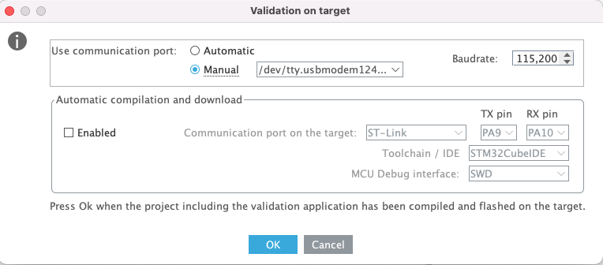

3. If you want to know model accuracy, please use `validate_on_target.ipynb` notebook.

    - **copy the CLI command** from the X-CUBE-AI validation console into the configuration file (`./configs/cli_command.yaml`).

    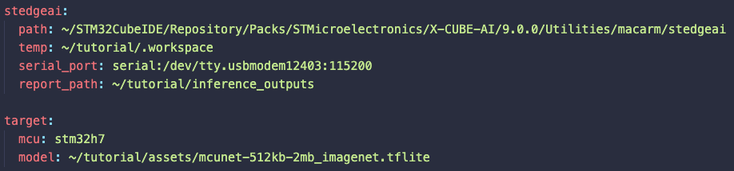

---

## 4. Contributing

Welcome any contributions to our project! Please submit a pull request or open an issue.

---